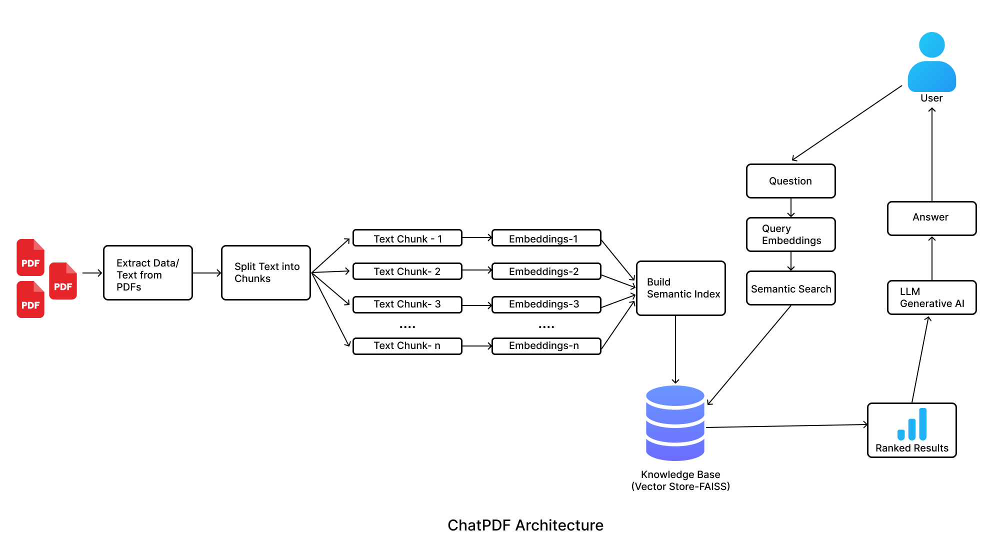

<div align="center">
       
      <h1>ChatPDF</h1>
  
*Read this in other languages: [English](README.md), [简体中文](README.zh-cn.md)*
      <h3>Interact with your PDF documents effortlessly</h3>
  <p>

  
  
  
  
  
  
  </p>
  </div>


  ## Table of contents

  - [Overview](#overview)
  - [Architecture](#architecture)
  - [Features](#features)
  - [Requirements](#requirements)
  - [Installation](#installation)
  - [Contributing](#contributing)


  ## Overview

  ChatPDF revolutionizes document interaction by combining advanced AI capabilities with user-friendly accessibility. Developed using Python and powered by the LangChain framework, ChatPDF facilitates seamless exploration and extraction of information from PDF documents through an intuitive web interface. Users can upload multiple PDF files, ask specific questions about their content, and receive detailed responses in real-time instantly.


  ## Architecture
  


  ## Features

  | Feature                        | Description                                                                                     |
  | ------------------------------ | ----------------------------------------------------------------------------------------------- |
  | PDF Processing                 | Upload multiple PDF files and have their contents processed for easy querying.                   |
  | Extensible Architecture        | Modular design allows for the addition of new features and integrations with minimal effort, code is modular, with interchangeable components that enhance reuse, maintainability, testing, and allow easy extensions and customizations. |
  | Conversational Interface       | Ask questions about your PDFs and get detailed, accurate responses.                               |
  | Interactive Chat Interface     | User-friendly chat interface built with Streamlit, allowing seamless interaction with the AI model. |
  | Financial Analysis Expertise   | Extract detailed financial information and present it with accuracy.                              |
  | Chat History Export            | Allows users to review and download chat history as a PDF document for reference.                         |
  | Reset Functionality            | Provides an option to reset the chat history, ensuring user privacy and a clean interface for new interactions.                       |
  | Integrations                  | Utilizes Google Generative AI for embeddings, FAISS for similarity search, Groq API for LLM models, and Streamlit for the web interface. Potential for further service integrations. |


  ## Requirements

  - `faiss-cpu`: Library for efficient similarity search
  - `groq`: Inferencing engine providing LLM models like Llama 3
  - `python-dotenv`: Library for managing environment variables from a `.env` file
  - `PyPDF2`: Library for extracting text from PDF files
  - `fpdf`: Library for creating PDF documents programmatically
  - `streamlit`: Web framework for interactive applications
  - `langchain`: Framework for natural language processing tasks
  - `langchain-groq`: Integration for Groq API and LLM models
  - `langchain_google-genai`: Integration for Google Generative AI embeddings
  - `langchain_community`: Additional community modules for LangChain framework


  ## Installation

  1.Clone this repository to your local machine using:
  ```bash
    git clone https://github.com/Adityathere/ChatPDF
  ```

  2.Navigate to the project directory:
  ```bash
    cd ChatPDF
  ```

  3.Install the required dependencies using pip:
  ```bash
    pip install -r requirements.txt
  ```

  4.Acquire API keys through [makersuite.google.com](https://makersuite.google.com) and [console.groq.com](https://console.groq.com) and put them in the `.env` file:
  ```bash
    GOOGLE_API_KEY="ENTER YOUR API"
    GROQ_API_KEY="ENTER YOUR API"
  ```


  ## Usage

  Run the Streamlit app by executing:

  ```bash
  streamlit run app.py
  ```

  <!-- CONTRIBUTING -->
  ## Contributing

  Contributions are what make the open source community such an amazing place to learn, inspire, and create. Any contributions you make are **greatly appreciated**.

  If you have a suggestion that would make this better, please fork the repo and create a pull request. You can also simply open an issue with the tag "enhancement".
  Don't forget to give the project a star⭐! Thanks again!

  1. Fork the Project
  2. Create your Feature Branch `git checkout -b feature/AmazingFeature`
  3. Commit your Changes `git commit -m 'Add some AmazingFeature'`
  4. Push to the Branch `git push origin feature/AmazingFeature`
  5. Open a Pull Request

